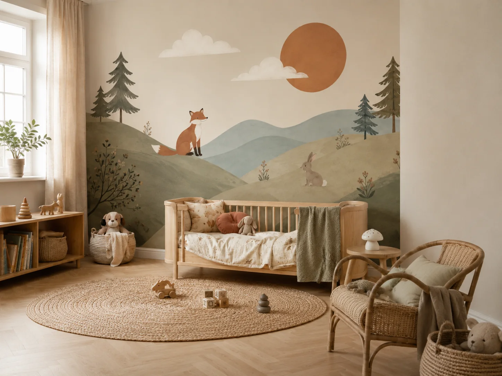
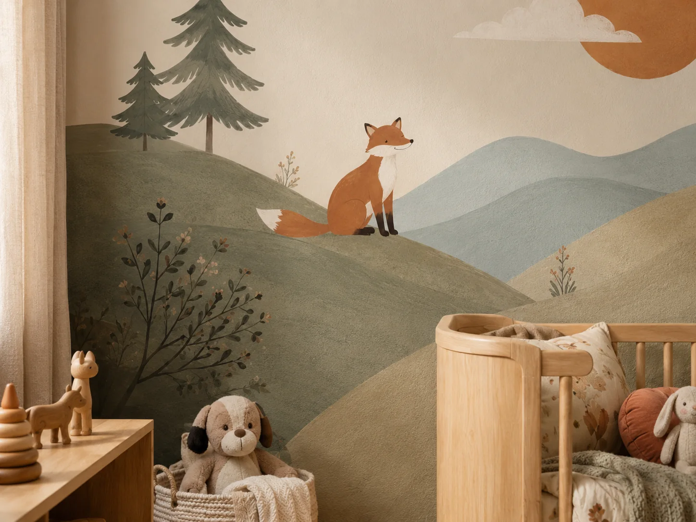
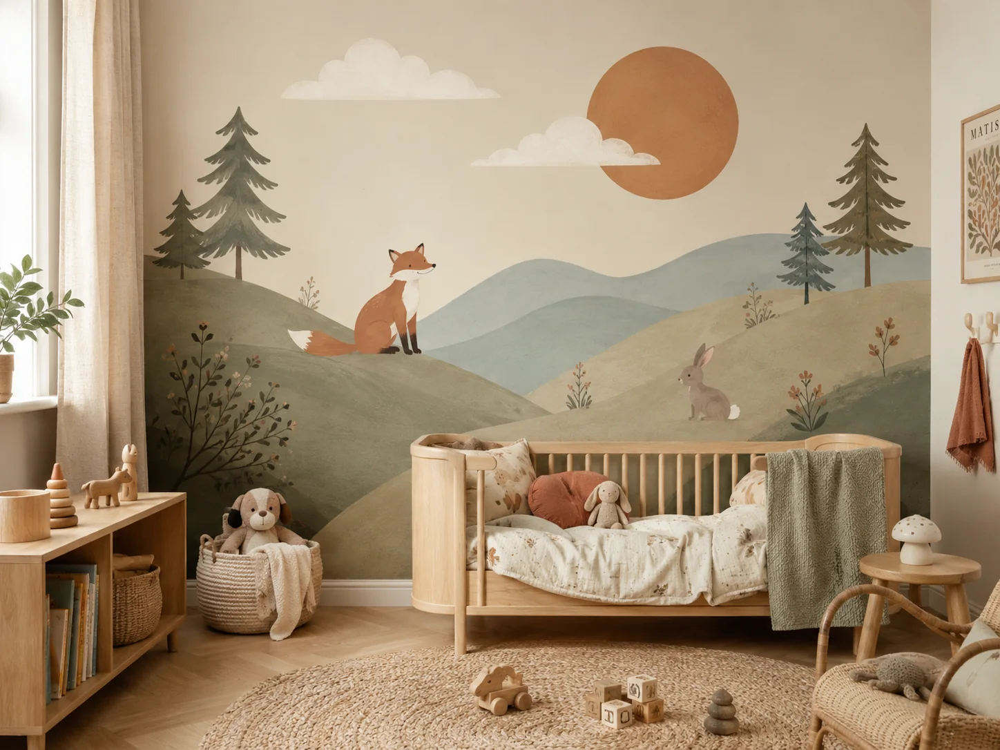
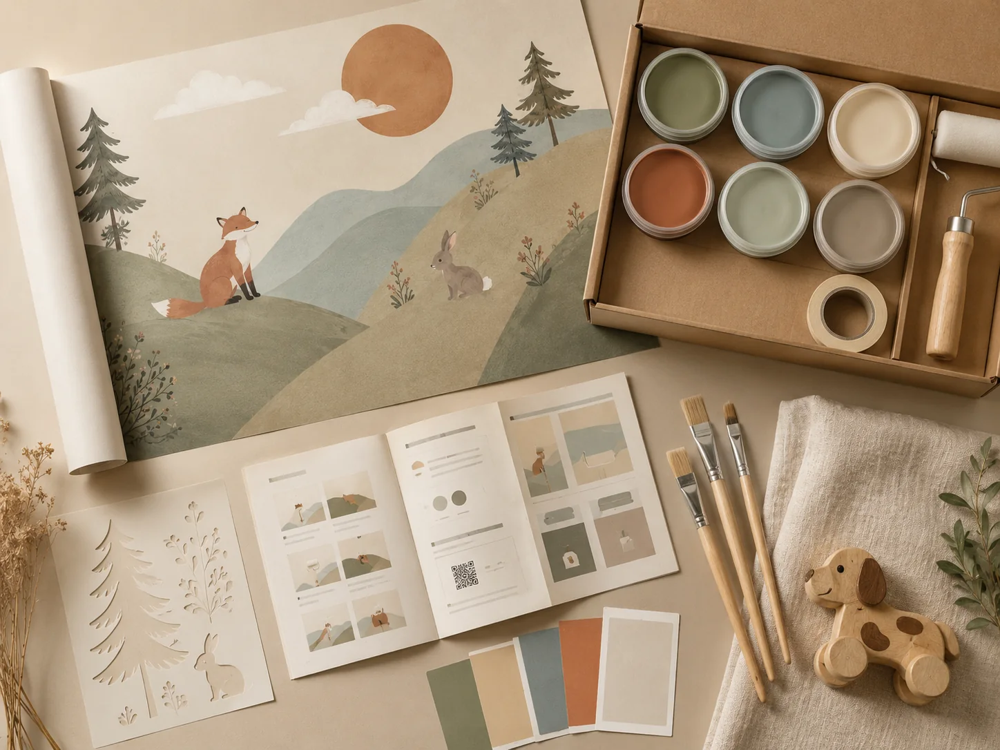
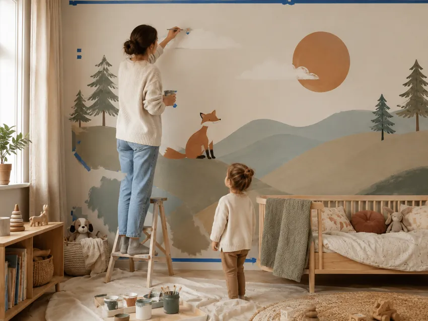

<!doctype html>
<html lang="en">
<head>
  <meta charset="utf-8">
  <meta name="viewport" content="width=device-width, initial-scale=1">
  <title>Little Wall Stories | DIY wall painting kits for children’s rooms</title>
  <meta name="description" content="Beautiful DIY wall painting kits for modern children’s rooms. Everything you need to paint a magical room, step by step — no artistic skill needed.">
  <meta name="theme-color" content="#efe5d8">
  <meta property="og:title" content="Little Wall Stories | DIY wall painting kits">
  <meta property="og:description" content="Create a beautiful children’s room yourself — with beginner-friendly mural kits designed for modern homes.">
  <meta property="og:type" content="website">
  <meta property="og:image" content="assets/hero.webp">
  <link rel="icon" href="assets/favicon.svg" type="image/svg+xml">
  <link rel="preload" as="image" href="assets/hero.webp">
  <link rel="stylesheet" href="styles.css">
  
</head>
<body>
  <a class="skip-link" href="#main">Skip to content</a>

  <header class="site-header" data-header>
    <nav class="nav shell" aria-label="Main navigation">
      <a class="brand" href="#top" aria-label="Little Wall Stories home">
        ☼
        Little Wall Stories
      </a>
      <button class="nav-toggle" type="button" aria-expanded="false" aria-controls="nav-menu" data-nav-toggle>
        Menu
      </button>
      

        <a href="#how-it-works">How it works</a>
        <a href="#kit">The kit</a>
        <a href="#shop">Shop</a>
        <a href="#faq">FAQ</a>
      

      <button class="cart-button" type="button" data-open-cart aria-label="Open cart">
        Cart
        0
      </button>
    </nav>
  </header>

  <main id="main">
    <section class="hero section" id="top">
      

        <picture>
          <source srcset="assets/hero-small.webp 850w, assets/hero.webp 1448w" type="image/webp">
          
        </picture>
      

      

      

        
DIY wall painting kits for children’s rooms

        <h1>Turn a blank wall into a little world of their own.</h1>
        
Beginner-friendly mural kits designed for modern parents. Everything is mapped out step by step, so you can create a beautiful children’s room without needing to be artistic.

        

          <a class="button button-primary" href="#shop">Choose your kit</a>
          <a class="button button-soft" href="#how-it-works">See how it works</a>
        

        

          No artistic skill needed
          Step-by-step guide
          Weekend-friendly project
        

      

    </section>

    <section class="section intro-strip" aria-label="Brand promise">
      

        

          
Designed for parents, loved by children

          <h2>A beautiful room makeover, made by you.</h2>
        

        
Our kits are made for adults who want a calm, premium children’s room with a personal touch. You get the design, colors, templates, and instructions — so the result feels custom, not complicated.

      

    </section>

    <section class="section split" id="transformation">
      

        

          
The transformation

          <h2>From plain wall to storybook room.</h2>
          
The product should immediately show parents what they are really buying: not paint, but confidence, inspiration, and a room their child will remember.

          <ul class="check-list">
            <li>Soft colors that fit modern interiors</li>
            <li>Simple shapes that are realistic to paint</li>
            <li>A finished look that feels calm, warm, and premium</li>
          </ul>
        

        <figure class="image-card large-card reveal">
          
          <figcaption>Use this section to show the emotional before-and-after.</figcaption>
        </figure>
      

    </section>

    <section class="section muted" id="how-it-works">
      

        
How it works

        <h2>Three simple steps. One magical result.</h2>
        
The buying journey needs to make the project feel easy before it asks for the sale.

      

      

        <article class="step-card reveal">
          01
          <h3>Choose your story</h3>
          
Pick a mural theme, size, and color palette that fits the room and your child’s personality.

        </article>
        <article class="step-card reveal">
          02
          <h3>Follow the guide</h3>
          
Use the templates, color cards, and clear instructions to map the design onto the wall.

        </article>
        <article class="step-card reveal">
          03
          <h3>Paint with confidence</h3>
          
Build the mural layer by layer with beginner-friendly shapes and forgiving organic details.

        </article>
      

      

        <figure class="image-card reveal">
          
        </figure>
        

          
Make it feel achievable

          <h3>No artistic background required.</h3>
          
Clear shapes, soft organic lines, and layered hills make small imperfections look natural. That is the conversion angle: parents should feel, “I can actually do this.”

        

      

    </section>

    <section class="section" id="kit">
      

        <figure class="image-card large-card reveal">
          
          <figcaption>Replace this concept image with your real kit photography later.</figcaption>
        </figure>
        

          
What’s inside

          <h2>Everything needed to start painting.</h2>
          
A strong kit section makes the price feel justified. It should show that the customer is buying a complete guided experience.

          

            
<strong>Paint colors</strong>Curated wall-safe shades for the selected design.

            
<strong>Templates</strong>Reusable guides for animals, plants, clouds, and details.

            
<strong>Step-by-step guide</strong>Simple instructions with order, timing, and tips.

            
<strong>Tools</strong>Brushes, tape, roller, and sample cards depending on the kit.

          

        

      

    </section>

    <section class="section shop-section" id="shop">
      

        
Choose your kit

        <h2>Start with the Forest Friends collection.</h2>
        
Keep the first offer focused. One beautiful theme with three sizes is easier to buy than a big catalog.

      

      

        <article class="product-card featured" data-product-card="complete">
          
Best first kit

          
          

            
Forest Friends

            <h3>Complete Mural Kit</h3>
            
For one feature wall. Includes the full rolling hills scene with fox, rabbit, trees, sun, clouds, and plants.

            

              €69
              Most popular
            

            <button class="button button-primary full" type="button" data-add-product="complete">Add complete kit</button>
          

        </article>

        <article class="product-card" data-product-card="accent">
          
Small room update

          
          

            
Forest Friends

            <h3>Accent Kit</h3>
            
For a smaller wall area, reading corner, or space above a bed. A lower-commitment first project.

            

              €39
              Starter size
            

            <button class="button button-outline full" type="button" data-add-product="accent">Add accent kit</button>
          

        </article>

        <article class="product-card" data-product-card="statement">
          
Big transformation

          
          

            
Forest Friends

            <h3>Statement Wall Kit</h3>
            
For a larger wall or premium nursery makeover. More paint, more templates, and expanded details.

            

              €119
              Full room impact
            

            <button class="button button-outline full" type="button" data-add-product="statement">Add statement kit</button>
          

        </article>
      

      

        

          
Customize before checkout

          <h3 id="customize-title">Pick the palette that fits the room.</h3>
          
These choices help parents feel guided while keeping the buying decision simple.

        

        <fieldset class="palette-options" aria-label="Color palette">
          <legend class="sr-only">Color palette</legend>
          <label class="palette-option selected">
            <input type="radio" name="palette" value="Soft Neutral" checked>
            <i style="--sw:#d9cbb6"></i><i style="--sw:#9a9f83"></i><i style="--sw:#c9845b"></i>
            Soft Neutral
          </label>
          <label class="palette-option">
            <input type="radio" name="palette" value="Warm Woodland">
            <i style="--sw:#87916f"></i><i style="--sw:#b96f4e"></i><i style="--sw:#e9d9c5"></i>
            Warm Woodland
          </label>
          <label class="palette-option">
            <input type="radio" name="palette" value="Dusty Pastel">
            <i style="--sw:#9eb5b8"></i><i style="--sw:#d7b3a0"></i><i style="--sw:#eee1cf"></i>
            Dusty Pastel
          </label>
        </fieldset>
      

    </section>

    <section class="section gallery-section" aria-label="Website image concepts">
      

        
Website storytelling images

        <h2>The shots your final photography should recreate.</h2>
      

      

        <figure class="gallery-item reveal">
          
          <figcaption>Hero / room reveal</figcaption>
        </figure>
        <figure class="gallery-item reveal">
          
          <figcaption>DIY process</figcaption>
        </figure>
        <figure class="gallery-item reveal">
          
          <figcaption>Detail / quality</figcaption>
        </figure>
        <figure class="gallery-item reveal">
          
          <figcaption>Kit contents</figcaption>
        </figure>
      

    </section>

    <section class="section muted reassurance-section">
      

        <article>
          ✦
          <h3>Beginner-friendly</h3>
          
Designed around simple shapes, forgiving lines, and clear visual steps.

        </article>
        <article>
          ♡
          <h3>Made for family rooms</h3>
          
A calm style that works with natural wood, soft textiles, and modern interiors.

        </article>
        <article>
          ✓
          <h3>Complete guidance</h3>
          
Templates, palettes, tools, and instructions reduce doubt before purchase.

        </article>
      

    </section>

    <section class="section reviews-section" aria-labelledby="reviews-title">
      

        
Parent confidence

        <h2 id="reviews-title">What customers should feel before buying.</h2>
      

      

        <figure class="review-card reveal">
          <blockquote>“I wanted something beautiful, but I was nervous I would ruin the wall. The guide made it feel very manageable.”</blockquote>
          <figcaption>— Example customer review</figcaption>
        </figure>
        <figure class="review-card reveal">
          <blockquote>“It looks like a custom mural, but we painted it over one weekend. Our daughter talks about the fox every night.”</blockquote>
          <figcaption>— Example customer review</figcaption>
        </figure>
        <figure class="review-card reveal">
          <blockquote>“The colors are calm enough for our home, but still magical for a child’s room.”</blockquote>
          <figcaption>— Example customer review</figcaption>
        </figure>
      

    </section>

    <section class="section split about-section" id="about">
      

        

          
A quiet kind of magic

          <h2>For parents who want personal, not perfect.</h2>
          
Little Wall Stories helps parents create children’s rooms with warmth, imagination, and a human touch. The result does not need to look machine-perfect. It should feel like something made with care.

          
Replace this text with your founder story once your brand name and origin are final.

        

        <figure class="image-card large-card reveal">
          
        </figure>
      

    </section>

    <section class="section muted faq-section" id="faq">
      

        

          
Questions before painting

          <h2>Reduce doubt before checkout.</h2>
          
The FAQ should answer practical objections at the exact moment the customer is close to buying.

        

        

          

            
Do I need painting experience?

            
No. The designs are created for beginners, using templates, soft organic shapes, and step-by-step instructions.

          

          

            
How long does one mural take?

            
Most customers should be able to complete a feature wall over a weekend, depending on wall size, drying time, and detail level.

          

          

            
What if I make a mistake?

            
The designs use layered hills, plants, and natural shapes, so small imperfections are easy to blend into the final mural.

          

          

            
Can I change the colors?

            
Yes. The kit is designed around curated palettes, but you can adapt the colors to match your room.

          

          

            
Is this a real checkout?

            
This static version includes the full webshop front end. Connect the checkout button to Shopify, Stripe Payment Links, WooCommerce, or another payment provider when you are ready to sell.

          

        

      

    </section>

    <section class="section final-cta">
      

        
Ready to create the room?

        <h2>A magical wall painting, made by you.</h2>
        
Choose your first kit and give parents a clear, confident next step.

        <a class="button button-primary" href="#shop">Shop the first collection</a>
      

    </section>
  </main>

  <footer class="site-footer">
    

      

        <a class="brand footer-brand" href="#top">
          ☼
          Little Wall Stories
        </a>
        
DIY wall painting kits for calm, modern children’s rooms.

      

      

        <h3>Shop</h3>
        <a href="#shop">Forest Friends</a>
        <a href="#kit">What’s inside</a>
        <a href="#faq">FAQ</a>
      

      

        <h3>Support</h3>
        <a href="mailto:hello@yourbrand.com">hello@yourbrand.com</a>
        <a href="#faq">Shipping & returns</a>
        <a href="#how-it-works">Painting guide</a>
      

      

        <h3>Social</h3>
        <a href="https://instagram.com/yourbrand">Instagram</a>
        <a href="https://pinterest.com/yourbrand">Pinterest</a>
        <a href="https://tiktok.com/@yourbrand">TikTok</a>
      

    

    

      ©  Little Wall Stories. Replace with your legal company name.
      Static demo site. Connect payment before launch.
    

  </footer>

  

    <a class="button button-primary" href="#shop">Choose your kit</a>
  

  <aside class="cart-drawer" aria-hidden="true" aria-labelledby="cart-title" data-cart-drawer>
    

    

      

        <h2 id="cart-title">Your kit</h2>
        <button class="icon-button" type="button" data-close-cart aria-label="Close cart">×</button>
      

      

        
Your cart is empty.

      

      

        
Subtotal<strong data-cart-subtotal>€0</strong>

        
Checkout is front-end only in this static version. Connect this button to your payment provider before launch.

        <button class="button button-primary full" type="button" data-checkout>Continue to checkout</button>
      

    

  </aside>

  

  
</body>
</html>
